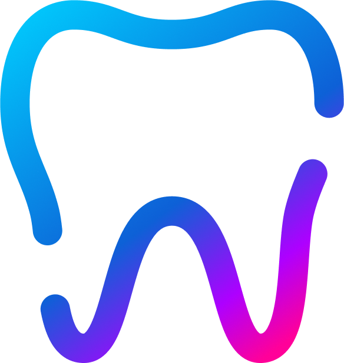

<a name="readme-top"></a>

<!-- PROJECT SHIELDS -->
<!--
*** I'm using markdown "reference style" links for readability.
*** Reference links are enclosed in brackets [ ] instead of parentheses ( ).
*** See the bottom of this document for the declaration of the reference variables
*** for contributors-url, forks-url, etc. This is an optional, concise syntax you may use.
*** https://www.markdownguide.org/basic-syntax/#reference-style-links
-->

[![Contributors][contributors-shield]][contributors-url]
[![Forks][forks-shield]][forks-url]
[![Stargazers][stars-shield]][stars-url]
[![Issues][issues-shield]][issues-url]
[![MIT License][license-shield]][license-url]
[![LinkedIn][linkedin-shield]][linkedin-url]

<!-- PROJECT LOGO -->
<br />
<div align="center">
  <a href="https://github.com/afmelo92/odontoapp">
    
  </a>

<h3 align="center">OdontoApp</h3>

  <p align="center">
    Full command center for dental clinics and labs
    <br />
    <a href="https://github.com/afmelo92/odontoapp"><strong>Explore the docs »</strong></a>
    <br />
    <br />
    <a href="https://github.com/afmelo92/odontoapp">View Demo</a>
    ·
    <a href="https://github.com/afmelo92/odontoapp/issues">Report Bug</a>
    ·
    <a href="https://github.com/afmelo92/odontoapp/issues">Request Feature</a>
  </p>
</div>

<!-- TABLE OF CONTENTS -->
<details>
  <summary>Table of Contents</summary>
  <ol>
    <li>
      <a href="#about-the-project">About The Project</a>
      <ul>
        <li><a href="#built-with">Built With</a></li>
      </ul>
    </li>
    <li>
      <a href="#getting-started">Getting Started</a>
      <ul>
        <li><a href="#prerequisites">Prerequisites</a></li>
        <li><a href="#installation">Installation</a></li>
      </ul>
    </li>
    <li><a href="#usage">Usage</a></li>
    <li><a href="#roadmap">Roadmap</a></li>
    <li><a href="#contributing">Contributing</a></li>
    <li><a href="#license">License</a></li>
    <li><a href="#contact">Contact</a></li>
    <li><a href="#acknowledgments">Acknowledgments</a></li>
  </ol>
</details>

<!-- ABOUT THE PROJECT -->

## About The Project

[![Product Name Screen Shot][product-screenshot]](https://odontoapp.tech)

OdontoApp is a full command central for dental clinics and dental prosthetics labs. It is different than others because
is focused on integrating labs and clinics. Also, in future updates, you can integrate supliers and patients. All in one app.

<p align="right">(<a href="#readme-top">back to top</a>)</p>

### Built With

- [![Next][Next.js]][Next-url]
- [![Node][Nodejs]][Node-url]

<p align="right">(<a href="#readme-top">back to top</a>)</p>

<!-- GETTING STARTED -->

## Getting Started

To start your development environment is pretty simple

### Prerequisites

- pnpm

  ```sh
  npm install -g pnpm
  ```

- docker

### Installation

1. Clone the repo
   ```sh
   git clone https://github.com/afmelo92/odontoapp.git
   ```

#### API

2 Change the main directory
`sh
    cd odontoapp-api
    ` 3. Install packages
`sh
    pnpm add
    ` 4. Fill the environment variables in the .env file

5. Run docker compose
   ```sh
   docker compose db -d
   ```
6. Now you can start the API with the following command
   ```sh
   pnpm dev
   ```

#### WEB

6. Change the main directory
   ```sh
   cd odontoapp-web
   ```
7. Install packages
   ```sh
   pnpm add
   ```
8. Fill the environment variables in the .env file

9. Now you can start the web server with the following command
   ```sh
   pnpm dev
   ```

<p align="right">(<a href="#readme-top">back to top</a>)</p>

<!-- USAGE EXAMPLES -->

## Usage

[![Signin Screen][product-screenshot-1]]
[![Signup Screen][product-screenshot-2]]
[![Dashboard Screen][product-screenshot-3]]
[![Profile Screen][product-screenshot-4]]
[![Appointments Screen][product-screenshot-5]]
[![Prosthetics Screen][product-screenshot-6]]
[![Shop Screen][product-screenshot-7]]

<p align="right">(<a href="#readme-top">back to top</a>)</p>

<!-- ROADMAP -->

## Roadmap

- [x] Signin/Signup
- [x] Profile
- [x] Patients
  - [x] Create
  - [x] Delete
  - [ ] Update
- [x] Prosthetics Order
  - [x] Create
  - [ ] Delete
  - [ ] Update
- [ ] Appointments
- [ ] Dashboard
- [ ] Shop

See the [open issues](https://github.com/afmelo92/odontoapp/issues) for a full list of proposed features (and known issues).

<p align="right">(<a href="#readme-top">back to top</a>)</p>

<!-- CONTRIBUTING -->

## Contributing

Contributions are what make the open source community such an amazing place to learn, inspire, and create. Any contributions you make are **greatly appreciated**.

If you have a suggestion that would make this better, please fork the repo and create a pull request. You can also simply open an issue with the tag "enhancement".
Don't forget to give the project a star! Thanks again!

1. Fork the Project
2. Create your Feature Branch (`git checkout -b feature/AmazingFeature`)
3. Commit your Changes (`git commit -m 'Add some AmazingFeature'`)
4. Push to the Branch (`git push origin feature/AmazingFeature`)
5. Open a Pull Request

<p align="right">(<a href="#readme-top">back to top</a>)</p>

<!-- LICENSE -->

## License

Distributed under the MIT License. See `LICENSE.txt` for more information.

<p align="right">(<a href="#readme-top">back to top</a>)</p>

<!-- CONTACT -->

## Contact

Andre Melo - andre@afmelo.com

Project Link: [https://github.com/afmelo92/odontoapp](https://github.com/afmelo92/odontoapp)

<p align="right">(<a href="#readme-top">back to top</a>)</p>

<!-- ACKNOWLEDGMENTS -->

## Acknowledgments

- []()
- []()
- []()

<p align="right">(<a href="#readme-top">back to top</a>)</p>

<!-- MARKDOWN LINKS & IMAGES -->
<!-- https://www.markdownguide.org/basic-syntax/#reference-style-links -->

[contributors-shield]: https://img.shields.io/github/contributors/afmelo92/odontoapp.svg?style=for-the-badge
[contributors-url]: https://github.com/afmelo92/odontoapp/graphs/contributors
[forks-shield]: https://img.shields.io/github/forks/afmelo92/odontoapp.svg?style=for-the-badge
[forks-url]: https://github.com/afmelo92/odontoapp/network/members
[stars-shield]: https://img.shields.io/github/stars/afmelo92/odontoapp.svg?style=for-the-badge
[stars-url]: https://github.com/afmelo92/odontoapp/stargazers
[issues-shield]: https://img.shields.io/github/issues/afmelo92/odontoapp.svg?style=for-the-badge
[issues-url]: https://github.com/afmelo92/odontoapp/issues
[license-shield]: https://img.shields.io/github/license/afmelo92/odontoapp.svg?style=for-the-badge
[license-url]: https://github.com/afmelo92/odontoapp/blob/master/LICENSE.txt
[linkedin-shield]: https://img.shields.io/badge/-LinkedIn-black.svg?style=for-the-badge&logo=linkedin&colorB=555
[linkedin-url]: https://linkedin.com/in/afdmelo
[product-screenshot]: images/screenshot.png
[product-screenshot-1]: images/signin_screen.png
[product-screenshot-2]: images/signup_screen.png
[product-screenshot-3]: images/dashboard_screen.png
[product-screenshot-4]: images/profile_screen.png
[product-screenshot-5]: images/appointments_screen.png
[product-screenshot-6]: images/prosthetics_screen.png
[product-screenshot-7]: images/shop_screen.png
[Next.js]: https://img.shields.io/badge/next.js-000000?style=for-the-badge&logo=nextdotjs&logoColor=white
[Next-url]: https://nextjs.org/
[Nodejs]: https://nodejs.org/en
